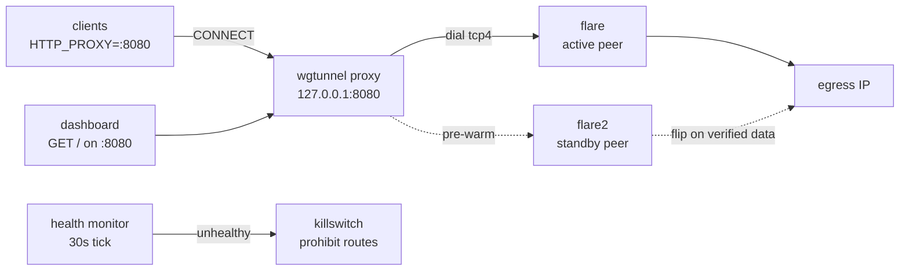

# WGTunnel

Rotate WireGuard egress IPs behind a local HTTP proxy with fail-closed killswitch.

[](https://go.dev)
[](#requirements)
[](LICENSE)

WireGuard counterpart to [FlareTunnel](https://github.com/arvindg4u/FlareTunnel):
there the egress pool is Cloudflare Workers, here it is N WireGuard peers.
One peer carries traffic at a time; rotation re-times the egress IP while a
health monitor holds a killswitch — routed traffic fails closed instead of
leaking direct.

The proxy is a **plain CONNECT passthrough** (no TLS interception): no CA to
install, strict HTTP clients work unchanged.

## Quick Start

```sh
cp peers.json.example peers.json   # fill in real keys (never commit!)
./build.sh
./wgtunnel proxy --route opencode.ai --verbose
# 🚀 WGTunnel Proxy Started — Listening: 127.0.0.1:8080 — Active peer: [0] peer-01
```

```sh
export HTTP_PROXY=http://127.0.0.1:8080 HTTPS_PROXY=http://127.0.0.1:8080
curl https://opencode.ai/   # exits via the tunnel
```

Open the dashboard: `http://127.0.0.1:8080/` (installable PWA, same port).

## Contents

- [Quick Start](#quick-start)
- [Features](#features)
- [Architecture](#architecture)
- [Requirements](#requirements)
- [Configuration](#configuration)
- [Commands](#commands)
- [Dashboard & API](#dashboard--api)
- [Operations](#operations)
- [Routing notes](#routing-notes)
- [Troubleshooting](#troubleshooting)
- [Development](#development)
- [Contributing](#contributing)
- [License](#license)

## Features

| Feature | What it does |
|---|---|
| Peer rotation | Timer-based (`--interval`, default 1800s) across N peers |
| Zero-downtime flip | Next peer pre-warmed on standby iface, flipped after verified handshake **+ data probe** |
| Killswitch | Unhealthy tunnel → routed destinations become `prohibit` routes (fail-closed, incl. IPv6) |
| Health monitor | Handshake freshness, dial-failure streaks, transfer-stall watchdog, backoff |
| Peer cooldowns | Failed peers skipped (5min × fails, cap 1h), desperation pass tries anyone before outage |
| Daily counters | Per-peer requests reset at 00:00 IST (`TODAY`/`YDAY` in `list`) |
| Blocklist | Telemetry/tracker domains get 403 before touching the VPN |
| Dashboard | Same-port UI + JSON API + PWA, rotate button, live log |
| 429 auto-rotate | External watcher rotates egress on upstream rate limits (see [Operations](#operations)) |

> ⚠️ Go slow: rotating or mass-testing too fast triggers server-side
> session throttling (handshakes succeed, data stops). Prefer `--interval`
> 1800s+ and test single peers with gaps.

## Architecture



One peer is live on `flare`; rotation warms the next on `flare2`, verifies
handshake **and real payload**, then flips routes and drops the old peer.

## Requirements

- Go 1.21+
- `wg` + `ip` (`wireguard-tools`, `iproute2`)
- Kernel WireGuard **or** `wireguard-go` userspace (auto-detected)
- root (interfaces + policy routing)
- Linux (Android/Termux supported, see below)

## Configuration

`peers.json` (git-ignored — real keys live here, never commit):

```json
[
  {"name": "peer-01", "private_key": "...", "public_key": "...",
   "endpoint": "203.0.113.10:51820", "address": "10.2.0.2/32"}
]
```

`blocklist.txt`: one domain pattern per line, matched against CONNECT hosts.

## Commands

```sh
./wgtunnel proxy --route opencode.ai --verbose   # start (see flags below)
./wgtunnel rotate --iface flare                  # next healthy peer now
./wgtunnel status                                # all live flare ifaces
./wgtunnel list                                  # peers, active/cooldown marked
./wgtunnel test --peer 4                         # probe one peer (scratch iface)
./wgtunnel export --output backup.json           # backup peers (keep secret!)
./wgtunnel import --input backup.json            # restore peers
./wgtunnel stop                                  # stop + clean routes/rules
./wgtunnel restart                               # stop + start with saved flags
./wgtunnel boot --route opencode.ai              # proxy -> gateway full stack
./wgtunnel dns [--off]                           # route system DNS via tunnel
```

`install.sh` creates system-wide `wgtunnel-*` wrappers in `/usr/local/bin`.

### `proxy` flags

| Flag | Default | Description |
|---|---|---|
| `--peers` | `/root/wgtunnel/peers.json` | Peer pool JSON |
| `--listen` | `127.0.0.1:8080` | Proxy listen address (dashboard lives here too) |
| `--iface` | `flare` | WireGuard interface (`flare2` = automatic standby) |
| `--interval` | `1800` | Rotation seconds (`0` disables; <600 clamped to 600) |
| `--timeout` | `25` | Handshake wait seconds per peer |
| `--route` | `""` | Hosts/CIDRs via tunnel, re-applied every 15s |
| `--blocklist` | `/root/wgtunnel/blocklist.txt` | Domain blocklist (empty to disable) |
| `--stats` | `/tmp/wgtunnel-stats.json` | Peer stats file |
| `--dns` | `false` | System DNS via tunnel (restored on exit) |
| `--verbose` | `false` | Verbose logging |

Clients (scoped to one process, not global):

```sh
HTTP_PROXY=http://127.0.0.1:8080 HTTPS_PROXY=http://127.0.0.1:8080 <command>
```

## Dashboard & API

`GET /` on the proxy port serves the dashboard (dark/light/system themes,
PWA installable, offline icons embedded — no CDN). Same-origin JSON API:

| Endpoint | Description |
|---|---|
| `GET /api/status` | Active peer, handshake age, totals, `rotating`, `rotate_in_s`, VIP health, killswitch |
| `GET /api/peers` | Per-peer requests/transfer/cooldown/active |
| `GET /api/snapshot` | Status + peers + log tail in one call (what the page polls) |
| `GET /api/log` | Last 40 proxy log lines |
| `POST /api/rotate` | Rotate now (429 if one already in flight) |
| `/manifest.webmanifest`, `/sw.js`, `/icon-*.png` | PWA assets |

Rotate-to-specific from shell: `kill -USR1 $(cat /tmp/wgtunnel-proxy.pid)`
(next peer) — the dashboard button and `/api/rotate` do the same over HTTP.

## Operations

- **429 auto-rotate:** the proxy is TLS-opaque, so a companion watcher
  (`watch-429.sh` in tor-proxy-toolkit) tails the API proxy's failure log
  and signals rotation on `FreeUsageLimitError`, with adaptive debounce.
- **Keepalive:** run under a supervisor loop that logs exit codes and
  restarts (`while true; do ./wgtunnel proxy ...; sleep 10; done`) —
  never run two proxies at once (second one fails to bind and churns
  activations).
- **Stop is clean:** `stop` and SIGTERM/SIGHUP remove policy routes/rules
  and restore DNS, so later starts never trip over stale entries.
- **Peaks to expect:** tunnel responses routinely take 6–8s; probes honor
  the full `--timeout`, and only 2 of 4 `opencode.ai` VIPs may answer via a
  given exit — the dashboard's Probe targets row shows per-VIP health.

## Routing notes

WGTunnel only routes what `--route` names (safe default on
Termux/Android policy routing); everything else goes direct. Per-host
policy routing used internally:

```sh
ip route replace <host-ip>/32 dev flare
ip rule add to <host-ip>/32 lookup main pref 100
```

IPv6 for routed hosts is fail-closed (`prohibit`), since the tunnel
carries no v6 address. On regular Linux you can route everything via a
dedicated table instead (see `git log` examples); on Termux install
`wireguard` + `wireguard-go` (`wg-quick` DNS/policy steps don't work
there — WGTunnel shells out directly and works around that).

## Troubleshooting

| Symptom | Cause → fix |
|---|---|
| `500 Unexpected error: All connection attempts failed` (upstream client) | `:8080` down → check `ss -ltnp \| grep 8080`, restart proxy |
| `bind: address already in use` | Two proxies running → kill extras, keep one |
| `❌ no healthy peer` at start | All probes failing: check VIP health on dashboard; wait out throttling, don't hammer restarts |
| `429 FreeUsageLimitError` keeps returning | Upstream quota, not tunnel: let watcher rotate; if it persists across peers, wait out the quota |
| Handshake ok, data dead | Server-side session throttling → cooldowns skip the peer automatically |
| Stale routes after crash | `stop` cleans; check `ip route show \| grep flare` |

## Development

```sh
./build.sh        # tidy + build (package-aware: builds all *.go)
go vet .          # static checks
go test ./...     # unit tests (cooldowns, day rollover, probe-host pick)
gofmt -l .        # must be clean
```

Layout: `proxy.go` (proxy loop, health, rotation), `peers.go` (peer
commands), `stats.go` (counters/cooldowns), `routes.go` (policy routing,
killswitch), `dashboard.go` (+`pwa_icons.go`, embedded UI),
`main.go` (CLI dispatch). `*_test.go` cover pure logic; anything needing
root/WireGuard is verified live, not in tests.

## Contributing

PRs welcome: keep the probe path (`probeDataPath`/`peerReady`/`activate`)
untouched unless fixing a proven probe bug, add tests for pure logic,
keep `gofmt`/`go vet`/`go test` green.

## License

MIT — see [LICENSE](LICENSE) for details.
